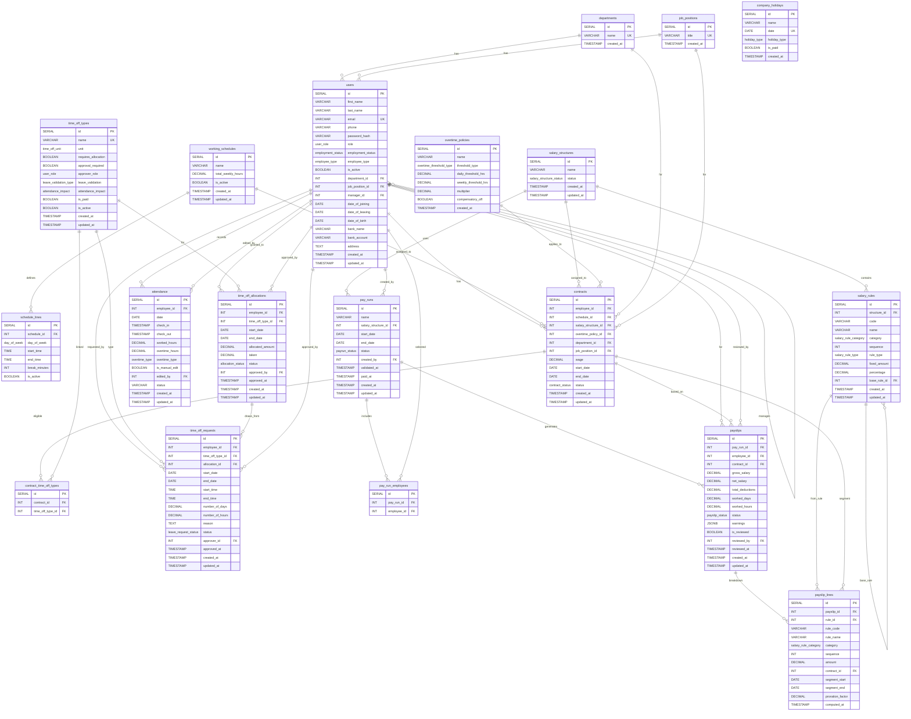

# PeoplePay360 — HR & Payroll

An integrated HR and payroll platform built for the Odoo hackathon problem statement
[`problem-statement.md`](problem-statement.md). The employee record is the hub: contracts and
working schedules give payroll its context, attendance and time off capture daily activity,
salary structures and rules define the computation, and pay runs turn all of it into validated,
printable payslips.

**Stack:** React 19 + Vite · Express 5 · PostgreSQL 18 · JWT auth in an HttpOnly cookie

---

## Contents

- [Quick start](#quick-start)
- [Demo logins](#demo-logins)
- [What's in the seed data](#whats-in-the-seed-data)
- [Guided demo — two end-to-end flows](#guided-demo--two-end-to-end-flows)
- [Features](#features)
- [Roles and permissions](#roles-and-permissions)
- [How payroll is computed](#how-payroll-is-computed)
- [Project structure](#project-structure)
- [Configuration reference](#configuration-reference)
- [Troubleshooting](#troubleshooting)
- [Roadmap](#roadmap)
- [ER Diagram](#er-diagram)

---

## Quick start

### Prerequisites

| Tool | Version | Notes |
| --- | --- | --- |
| Node.js | 20 or newer | `node -v` — the repo is developed on v24 |
| npm | 10 or newer | ships with Node |
| PostgreSQL | 14 or newer | a local server, Docker, or any hosted instance |

### 1. Create the database

```bash
createdb peoplepay360
```

Or, if you prefer Docker:

```bash
docker run -d --name peoplepay-db -p 5432:5432 \
  -e POSTGRES_PASSWORD=postgres -e POSTGRES_DB=peoplepay360 postgres:18
```

You do **not** need to run any migration or seed script by hand — the API applies
`server/src/config/init.sql` itself on startup (see the note below).

### 2. Start the API

```bash
cd server
cp .env.example .env       # then edit DATABASE_URL and JWT_SECRET
npm install
npm run dev
```

The API listens on <http://localhost:5001>. On a successful boot you'll see
`Database schema initialized successfully` followed by `Server running on port 5001`.

### 3. Start the web app

In a second terminal:

```bash
cd frontend
cp .env.example .env       # the default already points at localhost:5001
npm install
npm run dev
```

Open <http://localhost:5173> and sign in with any account from
[Demo logins](#demo-logins).

> [!IMPORTANT]
> **Every API start rebuilds the database.** `init.sql` drops all tables, recreates the schema
> and re-applies the seed data on each boot, so the demo always starts from a known state.
> The flip side: anything you create while exploring is discarded the next time you restart
> the server. Finish a demo flow before restarting, and don't point `DATABASE_URL` at a
> database that holds anything you care about.

---

## Demo logins

Every seeded account uses the same password: **`password123`**

| Role | Email | Who they are |
| --- | --- | --- |
| `admin` | `anish@peoplepay.dev` | Anish Goenka — Engineering Manager, full access to every module |
| `hr_payroll_manager` | `kavya@peoplepay.dev` | Kavya Iyer — Payroll Manager, full CRUD on pay runs, structures and rules |
| `hr_payroll_user` | `rohan@peoplepay.dev` | Rohan Desai — Payroll Executive, runs payroll but cannot edit salary rules |
| `hr_manager` | `priya@peoplepay.dev` | Priya Sharma — HR Manager, owns people data and leave approvals, no payroll |
| `hr_manager` | `meera@peoplepay.dev` | Meera Krishnan — HR Business Partner |
| `employee` | `rahul@peoplepay.dev` | Rahul Verma — Software Engineer, sees only his own records |

The other twelve seeded people are `employee`-role accounts and follow the same
`<firstname>@peoplepay.dev` pattern: `neha`, `arjun`, `vikram`, `karthik`, `ananya`, `divya`,
`sameer`, `ishita`, `aditya`, `pooja`, `nikhil`, `tara`.

---

## What's in the seed data

The dataset in `server/src/config/init.sql` is deliberately not uniform — it carries the edge
cases the payroll engine exists to handle, so the dashboard and the warning panels have
something real to show.

| Area | Contents |
| --- | --- |
| **People** | 18 employees across 7 departments, covering all 5 roles and all 4 employee types (full time, part time, contract, intern). One is serving notice, one was terminated mid-August. |
| **Schedules** | 4 working schedules: standard 40h Mon–Fri, part-time 20h, a Tue–Sat support shift, and a compressed 36h Mon–Thu week. Weekly hours are derived from the day lines. |
| **Contracts** | 22 contracts. Renewals and promotions keep their history, one employee has a **mid-month wage change on 16 Aug** (the pro-rata case), one contract expires 30 Sep with a **draft renewal** queued behind it. |
| **Salary** | 3 structures (India Standard CTC, Senior Management CTC, Intern & Contract Stipend) and 25 sequenced rules — fixed amounts, percentage-of-basic rules, and the GROSS/NET roll-ups. |
| **Time off** | 6 leave types, 54 allocations (approved, draft and refused), and 51 requests spanning approved, pending, refused, draft and withdrawn. Allocation `taken` balances match the approved requests exactly. |
| **Attendance** | 848 rows for **1 Jul – 5 Sep 2026**: 732 present, 57 on leave, 35 holiday, 12 half day, 12 absent — plus late arrivals, weekend and holiday shifts, overtime, manual HR corrections, and a handful of missing check-outs. |
| **Payroll** | July and August 2026 pay runs, both computed, validated and **paid** — 36 payslips, 375 payslip lines, ≈₹12.4L net per month. 26 payslips carry at least one warning. September is deliberately left open so the pay run wizard can be demonstrated on live data. |

Every seeded payslip was produced by running the real payroll engine
(`server/src/services/payrollEngine.service.js`) over this data — line amounts, proration
factors and warnings are exactly what a recompute would generate, not hand-written numbers.

**Warnings you can find in the seeded payslips:** `MISSING_BANK_DETAILS`,
`MISSING_CHECKIN_DAYS`, `UNREVIEWED_ATTENDANCE`, `UNPAID_LEAVE_DEDUCTION`,
`MULTIPLE_CONTRACTS`, `PRORATED_PAYSLIP`, `HOLIDAY_WORK_DETECTED`, `COMP_OFF_CREDITED`,
`MISSING_DATA`.

---

## Guided demo — two end-to-end flows

### A. Leave allocation → request → approval → attendance → payroll (≈2 min)

1. Sign in as **Priya** (`priya@peoplepay.dev`), the HR Manager.
2. **Time Off → Allocations** — Ananya Rao has a *draft* Earned Leave top-up. Approve it and
   watch her balance change.
3. **Time Off → Requests** — four requests are `pending`. Open Ananya's 14–18 Sep request and
   approve it; the allocation's *taken* and *remaining* update immediately.
4. **Attendance** — filter to Rahul Verma, August. His 20–21 Aug rows sit at `on_leave`
   against an **unpaid** leave type.
5. Open Rahul's August payslip (as Kavya, below) and find the `UNPAID_LV` line: the deduction
   is derived from the interim gross and the period's workday count, not hard-coded.

### B. Pay run wizard → compute → validate → pay → PDF (≈3 min)

1. Sign in as **Kavya** (`kavya@peoplepay.dev`), the Payroll Manager.
2. **Payroll → Pay Runs → New**. Step 1: pick the period **1–30 Sep 2026**. Step 2: choose the
   employees. Nothing is written until you press *Create Pay Run*.
3. **Compute** — payslips appear with their salary breakdown and warnings.
4. Open **Anish Goenka's August payslip** (from the closed August run) to see the pro-rata
   case: his wage changed on 16 Aug, so the payslip splits into two contract segments with
   `0.4762` and `0.5238` proration factors (10 and 11 of the month's 21 workdays), each with
   its own BASIC/HRA/allowance lines drawn from a different salary structure. Tara D'Souza's
   August payslip shows the other pro-rata case — a contract that ended mid-month, at `0.7143`.
5. Back on the September run: **Validate**, then **Mark as Paid**.
6. Open any payslip and use **Print / Save as PDF**.
7. Sign in as **Rahul** to confirm an employee sees only his own payslips and records.

> [!TIP]
> The **Reports → Dashboard** opens on the *current* month, which has no closed payroll until
> you run step B. Switch the period filter to **August 2026** to see it fully populated:
> ₹12.4L net across 18 payslips, salary cost split over all seven departments, the Jul → Aug
> trend, and the missing-bank-details alert. The department and employee-type filters
> re-aggregate the same live data.

---

## Features

**Employee master data** — list and form views, department/manager/schedule/position on the
employee record, and direct navigation to the related contracts, attendance and time off.

**Contract management** — full history per employee, active-contract highlighting, and
period-aware resolution so payroll only ever uses the contract that applies to the pay period.
Overlapping active contracts are rejected in application logic.

**Working schedules** — a weekly pattern of day, start, end and break; total weekly hours are
computed from the lines rather than typed in. Schedules drive workday counts, proration and
the overtime hourly rate.

**Time off** — configurable leave types (unit, allocation requirement, approval workflow,
attendance impact, paid/unpaid), allocations with taken/remaining tracking and validity
windows, and a request/approval flow that consumes the matching allocation on approval.

**Attendance** — check-in, check-out, worked hours, overtime and status, with manual
corrections restricted to authorised users and flagged with an editor id. Exceptions
(missing check-outs, absent workdays, holiday work) surface as payroll warnings.

**Salary configuration** — structures containing sequenced rules; fixed and
percentage-of-another-rule computation, with categories for basic, allowance, gross,
deduction and net.

**Payroll** — a two-step pay run wizard (scope, then employee selection), then
Compute → Validate → Mark Paid. Payslips show the per-rule breakdown, worked days and hours,
and any warnings; **Print / Save as PDF** produces a printable payslip. Payslip lines are
snapshots, so later edits to a salary rule never rewrite historical payroll.

**Dashboard** — live KPIs, salary cost by department, monthly net salary trend, attendance
health and leave overview, filterable by period, department and employee type.

**Audit trail** — a database trigger records every insert/update/delete on users, contracts,
attendance, leave requests, pay runs and payslips into `audit_logs` as JSONB. The triggers are
attached *after* seeding, so the log starts empty.

---

## Roles and permissions

| Capability | employee | hr_manager | hr_payroll_user | hr_payroll_manager | admin |
| --- | :-: | :-: | :-: | :-: | :-: |
| Own profile, attendance, leave balance | ✅ | ✅ | ✅ | ✅ | ✅ |
| Create own attendance & time off requests | ✅ | ✅ | ✅ | ✅ | ✅ |
| CRUD employees, contracts, schedules, attendance | — | ✅ | ✅ | ✅ | ✅ |
| Approve / refuse time off | — | ✅ | ✅ | ✅ | ✅ |
| Read pay runs & payslips | — | — | ✅ | ✅ | ✅ |
| Create pay runs, compute, review payslips | — | — | ✅ | ✅ | ✅ |
| Validate / mark paid / delete pay runs | — | — | — | ✅ | ✅ |
| CRUD salary structures & rules | — | — | read-only | ✅ | ✅ |
| User management & role assignment | — | — | — | — | ✅ |
| Audit trail | — | — | — | — | ✅ |

Enforcement lives in `server/src/middlewares/auth.js` (`requireAuth`, `requireOwnerOrRoles`)
with the role groups defined in `server/src/lib/roles.js`. The frontend mirrors the same
groups in `ProtectedRoute` — the API is the authority.

---

## How payroll is computed

The engine is documented in full in [`payroll-computation-algorithm.md`](payroll-computation-algorithm.md).
The short version, per employee per pay run:

1. **Resolve contracts** overlapping the period. More than one means a mid-period change.
2. **Segment and prorate** — each contract becomes a segment whose
   `proration_factor = segment workdays ÷ period workdays`, counted against that contract's
   working schedule.
3. **Run the rules** of each segment's own salary structure in `sequence` order. `BASIC` takes
   the contract wage; fixed rules scale by the proration factor; percentage rules read their
   already-prorated base. Deductions are stored negative.
4. **Overtime** — priced off the contract's schedule (`wage ÷ (period workdays × daily hours)`)
   times the policy multiplier. A comp-off policy credits leave instead of paying out.
5. **Unpaid leave** — the sole mechanism for unpaid-leave reduction, deducted at the interim
   gross per-day rate. Proration is a pure calendar fraction and never double-counts it.
6. **Aggregate** — `gross` = basic + allowances, `deductions` = |deduction lines|,
   `net` = gross − deductions; the GROSS/NET placeholder lines are back-filled with the totals.
7. **Worked days** = present days + paid holidays falling on scheduled workdays.
8. **Warn** — missing bank details, missing check-outs, workdays with neither attendance nor
   leave, duplicate payslips, inactive structures, negative net, and more.

---

## Project structure

```
.
├── server/                      Express 5 API
│   └── src/
│       ├── config/              db pool, logger, init.sql (schema + seed)
│       ├── routes/              one router per module, mounted under /api
│       ├── controllers/         request/response handling
│       ├── services/            business logic, incl. payrollEngine.service.js
│       ├── repositories/        SQL — no business logic
│       ├── middlewares/         auth (JWT + RBAC), validation, rate limiting
│       └── lib/ utils/          shared constants, errors, date & numeric helpers
├── frontend/                    React 19 + Vite SPA
│   └── src/
│       ├── api/                 typed fetch wrappers per module
│       ├── pages/               employees, contracts, attendance, timeoff, payroll, dashboard, audit
│       ├── components/          Topbar, ProtectedRoute, shared UI
│       └── context/             AppContext (session + current user)
├── bruno-api-collection/        Bruno request collection covering every endpoint
├── problem-statement.md         The hackathon brief
├── business-logic.md            Domain rules and edge cases
├── payroll-computation-algorithm.md   The payroll engine specification
└── API_BLUEPRINT.md / API_ENDPOINTS.md / PAYROLL_API_REFERENCE.md
```

### API surface

All routes are mounted under `/api` and, apart from login and logout, require the session
cookie:

`auth` · `employees` · `contracts` · `departments` · `job-positions` · `schedules` ·
`attendance` · `time-off-types` · `holidays` · `allocations` · `leave-requests` ·
`salary-structures` · `salary-rules` · `pay-runs` · `payslips` · `dashboard` · `audit-logs`

The [`bruno-api-collection/`](bruno-api-collection) folder opens directly in
[Bruno](https://www.usebruno.com/) with a request per endpoint.

---

## Configuration reference

**`server/.env`**

| Variable | Required | Default | Purpose |
| --- | :-: | --- | --- |
| `DATABASE_URL` | yes | — | PostgreSQL connection string |
| `JWT_SECRET` | yes | — | Signing key for the session cookie |
| `JWT_EXPIRES_IN` | no | `7d` | Token lifetime |
| `PORT` | no | `5001` | API port |
| `NODE_ENV` | no | — | `development` logs every SQL statement with its duration |
| `CLIENT_ORIGIN` | no | `http://localhost:5173` | CORS origin; must match the web app |

**`frontend/.env`**

| Variable | Required | Default | Purpose |
| --- | :-: | --- | --- |
| `VITE_API_URL` | yes | `http://localhost:5001/api` | API base URL |

---

## Troubleshooting

**`Database initialization failed` on boot** — `DATABASE_URL` is wrong or the database doesn't
exist yet. Check with `psql "$DATABASE_URL" -c 'select 1'` and create it with
`createdb peoplepay360`.

**Login succeeds but every request then returns 401** — the browser isn't keeping the session
cookie. `CLIENT_ORIGIN` on the API must match the origin the web app is served from exactly,
including the port, and `VITE_API_URL` must point at the API.

**`Invalid token signature`** — `JWT_SECRET` changed since you signed in. Log out and back in.

**The data I created disappeared** — the API restarted and re-ran `init.sql`. This is by
design; see the note in [Quick start](#quick-start).

**Port 5001 already in use** — set `PORT` in `server/.env` and update `VITE_API_URL` to match.

---

## Roadmap

Given more time, in priority order:

1. **Bulk payslip email** — the *Send Payslips* action is present on the pay run screen but
   disabled; it needs an SMTP integration and a server-rendered PDF attachment.
2. **Server-side PDF generation** — today the payslip PDF comes from the browser's print
   dialog, which is fine for one payslip but not for a batch.
3. **Separate seed from schema** — `init.sql` currently rebuilds everything on boot, which is
   ideal for a demo and wrong for anything else. Split it into migrations plus an opt-in
   `npm run seed`.
4. **Automated tests for the payroll engine** — the algorithm is specified in enough detail to
   be table-driven; the proration, unpaid-leave and overtime branches deserve fixtures.
5. **Richer salary rules** — slab-based tax, employer-side contributions, and formula rules
   beyond fixed and percentage.
6. **Leave accrual** — monthly accrual and carry-forward, instead of a single annual grant.
7. **Redis-backed token revocation** — the client and the middleware hook already exist
   (`server/src/config/redis.js`); the blacklist check is commented out.

---

# ER Diagram

