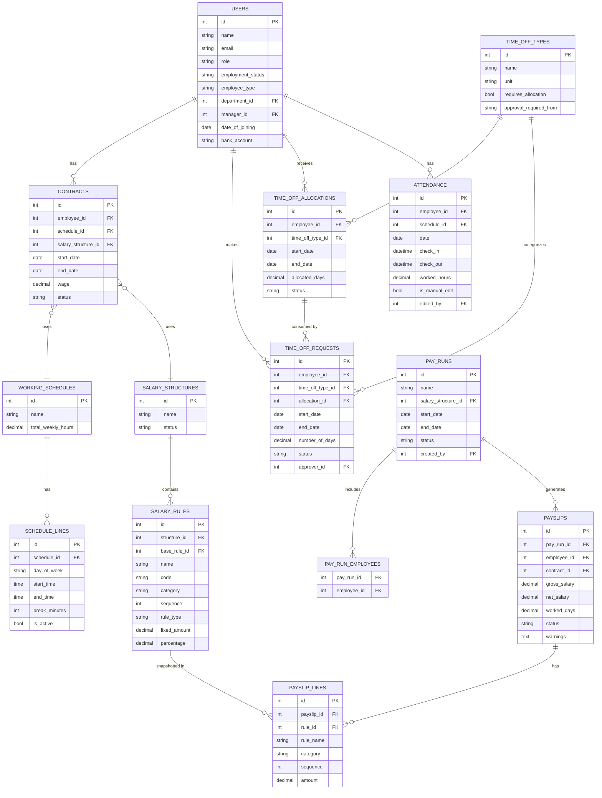

# PeoplePay360 — Schema Review & Validation

> [!IMPORTANT]
> **24-hr Hackathon Context:** Recommendations are split into **Must Have** (core judging criteria), **Should Have** (robustness), and **Nice to Have** (polish). Skip Nice-to-Haves unless you have time.

---

## 1. Entity-by-Entity Feedback

### 👤 Users / Employees

| What you have | Gap / Issue | Recommendation |
|---|---|---|
| Name, personal, corporate data, status | No `role` field modeled | Add `role ENUM('employee','hr_manager','hr_payroll_user','hr_payroll_manager','admin')` — required for RBAC |
| Status | Vague — is this employment status or system status? | Use two: `employment_status ENUM('active','on_notice','terminated')` and a system `is_active BOOL` |
| — | No `department_id`, `manager_id`, `job_position` | Needed per spec (A1). Add FKs to `departments` and `job_positions` tables OR inline as strings for speed |
| — | No `bank_details` | Payrun warns on missing bank details (B6). Add `bank_account`, `bank_name` — even as nullable strings |
| — | No `date_of_joining`, `date_of_leaving` | Required for pro-rated salary calculation and contract-validity checks |
| — | No `employee_type` (`full_time`, `part_time`, `contract`) | Dashboard filter on employee type (A7) requires this |

---

### 📅 Schedule Types (Working Schedules)

| What you have | Gap / Issue | Recommendation |
|---|---|---|
| 7-day columns per schedule | **Columnar anti-pattern** — not flexible, hard to query weekly hours | Replace with `schedule_lines` child table: `(schedule_id, day_of_week ENUM, start_time, end_time, break_minutes, status)` |
| `status (used/unused)` on each day | Semantics unclear | Use `is_active BOOL` on the day line; the schedule itself has `total_weekly_hours` (computed or stored) |
| Weekly hours shown in list view | You rely on "derived" but list views need fast reads | Store `total_weekly_hours DECIMAL` on the schedule, recompute on save |

> [!WARNING]
> The "7 columns per day" approach means you cannot query "all Mondays with start_time < 09:00" without column-by-column logic. Use a **child rows** pattern instead.

---

### 📄 Contracts

| What you have | Gap / Issue | Recommendation |
|---|---|---|
| user_id, schedule_type, salary_structure | Missing `start_date`, `end_date`, `status ENUM('draft','active','expired','cancelled')` | **Critical** — payroll must pick the contract valid for the pay period |
| — | Missing `wage` / `basic_salary` | Core spec field (A2) |
| — | Missing `department_id`, `job_position_id` | Contract form captures these (A2) |
| — | No uniqueness rule documented | Enforce: **no two active contracts for the same employee overlap in date** — enforce in app logic or a partial unique index |
| Eligible Time off Types (junction) | Correct approach ✅ | — |

> [!CAUTION]
> If you skip `start_date`/`end_date` on contracts, payroll computation will have no way to determine which contract applies to a pay period. This will break a core judging criterion.

---

### 🏖️ Time Off Types

| What you have | Gap / Issue | Recommendation |
|---|---|---|
| Type name, unit, status, approval_from | `unit` should live on the Type, not just the policy | ✅ Correct, keep unit here |
| `approval_from (user type)` | Which user type approves? HR Manager? | Store as `approval_required BOOL` + `approver_role ENUM` |
| — | Missing `requires_allocation BOOL` | Some leaves are unlimited (sick leave); others need allocation. This flag drives balance logic |
| — | Missing `leave_validation_type` | E.g., `no_validation`, `hr`, `manager` |

---

### 📋 Time Off Allocation Policy

| What you have | Gap / Issue | Recommendation |
|---|---|---|
| Start date, end date, allocated amount | Missing `employee_id` or `department_id` — who is this allocation for? | Add `employee_id FK` (individual) or `department_id FK` (bulk) |
| — | Missing `time_off_type_id FK` | Without this, allocation isn't linked to a type |
| "Duration taken/remaining computed from leaves table" | ✅ Good — but be careful with performance on large datasets | Pre-compute `taken` and store; recompute on approval |
| — | No `approval_status` on allocation itself | Spec says allocations require approval (A4) |

---

### 📆 Time Offs (Leave Requests)

| What you have | Gap / Issue | Recommendation |
|---|---|---|
| Employee, type, start/end, approval_status | Missing `number_of_days` / `number_of_hours` | Always store computed duration to avoid re-calculation edge cases (half-days, partial hours) |
| `approval_status (Pending/Approved)` | Missing `Refused` state | Add `Refused` — HR needs to refuse requests |
| — | No `approver_id` / `approved_at` | Audit trail requirement |
| — | No link to allocation | When approved, system must deduct from which allocation? Add `allocation_id FK` (nullable for non-allocation types) |

---

### 🕐 Attendance

| What you have | Gap / Issue | Recommendation |
|---|---|---|
| user_id, date, start_time, end_time, status | `status (present/absent/on leave)` — "on leave" needs to come from Time Off, not be a separate flag | Keep it as a computed/derived display; store only check-in/check-out times |
| — | Missing `is_manual_edit BOOL` + `edited_by FK` | Spec requires manual correction tracking (B3) |
| — | Missing `overtime_hours DECIMAL` | Dashboard tracks overtime explicitly (B9); either store or compute consistently |
| — | No `schedule_id` reference | To compute late/absent/overtime, attendance must know the expected schedule |
| Worked hours derived | ✅ Fine, but store it too | `worked_hours = end_time - start_time - break_time`; store it for fast list-view display |

---

### 💰 Salary Structure & Rules

| What you have | Gap / Issue | Recommendation |
|---|---|---|
| Structure → Rules (1:many) | ✅ Core relationship correct | — |
| `Rule type (Fixed / Derived)` + derived_rule_id | **Recursive dependency** — a rule can depend on another | Ensure your execution_order enforces dependency resolution (process in order, lower = earlier) |
| `Derived Percentage` + `Derived rule id` | What is the percentage applied to? The result of `derived_rule_id`? | Be explicit: `base_rule_id FK` + `percentage DECIMAL` = `amount = rules[base_rule_id].result * percentage / 100` |
| — | Missing `category ENUM('basic','allowance','deduction','gross','net')` in schema | You listed it but didn't formalize it — essential for payslip display grouping |
| — | No formula/expression support | Spec mentions "formulas" (A6). For hackathon: support Fixed + % of another rule. Skip arbitrary formula engine |

> [!TIP]
> For 24 hrs, support only 2 rule types: **Fixed** and **% of another rule's result**. This covers Basic + HRA + PF + Net cleanly.

---

### 💳 Pay Run

| What you have | Gap / Issue | Recommendation |
|---|---|---|
| Name, start/end date, status | Missing `salary_structure_id FK` | Step 1 of wizard selects structure (B5) |
| `PayRun-Employee Linkage` table | ✅ Correct M:M approach | — |
| — | Missing `created_by FK` | Audit trail |
| — | No `validated_at`, `paid_at` timestamps | Required for history / dashboard |

---

### 🧾 Payslip

| What you have | Gap / Issue | Recommendation |
|---|---|---|
| payslip_id, employee_id, pay_run_id | ✅ Correct | — |
| `Payslip Salary Breakdown` — derived | **Must be persisted, not just derived** | Compute and snapshot salary lines at generation time. Never recompute from live rules — rules may change |
| — | Missing `net_salary DECIMAL`, `gross_salary DECIMAL` | Store top-level aggregates for dashboard KPIs and list views |
| — | Missing `worked_days INT`, `worked_hours DECIMAL` | Payslip form shows these (B7) |
| — | Missing `status ENUM('draft','computed','validated','paid','cancelled')` | Required for payrun workflow |
| — | No `warnings JSONB / TEXT` | Store payroll warnings (missing bank, duplicate, etc.) per payslip |

---

### 🧩 Payslip Line Items (Salary Breakdown)

You mention this as "derived from salary structure" — but you need a **concrete table**:

```sql
payslip_lines (
  id            PK,
  payslip_id    FK → payslips,
  rule_id       FK → salary_rules,
  rule_name     VARCHAR,   -- snapshot at time of computation
  category      VARCHAR,   -- snapshot
  sequence      INT,
  amount        DECIMAL,
  computed_at   TIMESTAMP
)
```

> [!IMPORTANT]
> **Snapshot rule name/category/amount** — never join live to salary_rules at report time. Rules get modified and you must preserve historical payslip accuracy.

---

## 2. Missing Entities

| Missing Table | Why Needed |
|---|---|
| `departments` | Employee form, dashboard filter by department (A7, B9) |
| `job_positions` | Contract form captures position (A2) |
| `pay_slip_lines` | Concrete storage for salary breakdown (see above) |
| `audit_log` (optional) | Manual attendance corrections require `edited_by` tracking |

---

## 3. Critical Business Logic to Encode

### Contract Validity Check
```
Given pay_run.start_date and pay_run.end_date:
  contract = contracts WHERE employee_id = X
              AND start_date <= pay_run.end_date
              AND (end_date IS NULL OR end_date >= pay_run.start_date)
              AND status = 'active'
  → If 0 contracts: warning "No active contract"
  → If >1 contracts: warning "Multiple active contracts — overlap detected"
```

### Leave Balance Computation
```
available = allocation.allocated_amount
            - SUM(time_offs.number_of_days WHERE status = 'approved'
                  AND time_off_type_id = allocation.time_off_type_id
                  AND employee_id = allocation.employee_id)
```

### Salary Rule Execution Order
```
Process rules sorted by execution_order ASC:
  computed_values = {}
  For each rule:
    if rule.type == 'fixed':
      computed_values[rule.id] = rule.fixed_amount
    elif rule.type == 'percentage':
      base = computed_values[rule.base_rule_id]
      computed_values[rule.id] = base * rule.percentage / 100
  net = SUM of all rules in 'net' category
```

---

## 4. Hackathon Tradeoffs

### ✅ Do These (Must Have — affects judging)

| Decision | Rationale |
|---|---|
| Persist payslip lines as a snapshot table | Without this, payslips break if rules change |
| `start_date` / `end_date` + `status` on contracts | Core payroll correctness |
| `requires_allocation` on TimeOffType | Drives leave balance logic |
| Store `worked_hours`, `net_salary`, `gross_salary` | Dashboard KPIs & list views won't work otherwise |
| `schedule_lines` child table (not 7 columns) | Querying and weekly-hours calculation become trivial |

### ⚠️ Simplify These (Should Have)

| Decision | Simplification |
|---|---|
| Salary rule formula engine | Support only Fixed + % of another rule. Skip arbitrary code/expression evaluation |
| Allocation approval workflow | Approve via simple status update — skip multi-step workflow |
| Departments | Use a simple `department VARCHAR` on employees/contracts instead of a normalized table if short on time |
| RBAC | Middleware role check on API routes — don't build a full permission table |

### 🚫 Skip These (Nice to Have — not judged)

| Decision | Rationale |
|---|---|
| Pro-ration for partial months | Complex, safe to skip for demo |
| Multi-currency | Not in spec |
| Formula/code-expression rules | Over-engineering for 24 hrs |
| Full audit log table | Add `edited_by` to attendance only |

---

## 5. Recommended Final Schema (ERD Summary)



---

## 6. Quick Wins for Demo

1. **Seed script** — pre-populate 5 employees, 2 salary structures (Basic + HRA + PF), 1 pay run → immediate demo-ready state
2. **Payroll warnings** — check for missing bank account & no active contract when computing a payrun. Surface as a badge.
3. **Leave balance widget** — `allocated - approved_requests` shown on employee form. High visual impact, low effort.
4. **Dashboard KPIs** — `COUNT(payslips)`, `SUM(net_salary)`, `AVG(net_salary)` per pay run. Simple SQL aggregates.
